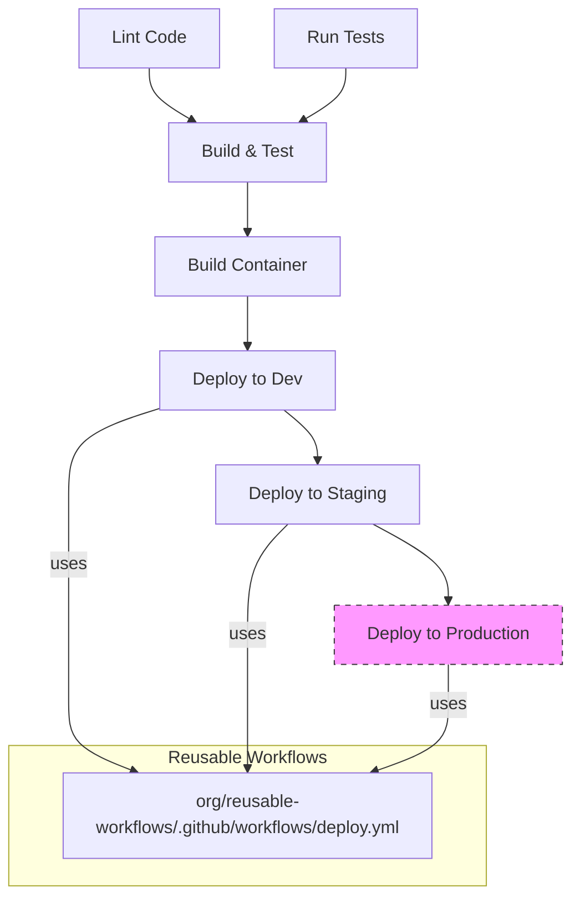

# GitHub Actions Workflow: Example CI/CD Pipeline

<div align="center">
  
</div>

## Overview

This workflow handles the continuous integration and continuous deployment process for a containerized application. It builds, tests, and deploys the application to multiple environments based on branch or tag patterns.

**File Path**: `.github/workflows/cicd-pipeline.yml`

<div class="workflow-diagram">
  
</div>



## Triggers

| Event Type          | Conditions                                                                   | Description                                                        |
| ------------------- | ---------------------------------------------------------------------------- | ------------------------------------------------------------------ |
| `push`              | <ul><li>branches: main, develop</li><li>paths: src/**, tests/**</li></ul>    | Triggered when code is pushed to the repository                    |
| `pull_request`      | <ul><li>branches: main, develop</li><li>types: opened, synchronize</li></ul> | Triggered when a pull request is opened, synchronized, or modified |
| `workflow_dispatch` |                                                                              | Manually triggered through the GitHub UI or API                    |

## Inputs

| Name          | Description                   | Required | Default  | Type    |
| ------------- | ----------------------------- | -------- | -------- | ------- |
| `environment` | Target deployment environment | true     | `dev`    | string  |
| `debug`       | Enable debug mode             | false    | `false`  | boolean |
| `version`     | Version to deploy             | false    | `latest` | string  |

## Environment Variables

| Name        | Description           | Required |
| ----------- | --------------------- | -------- |
| `NODE_ENV`  | Node environment      | Yes      |
| `LOG_LEVEL` | Application log level | No       |

## Jobs

### 🔍 lint

**Description**: Lints the codebase

**Runs On**: ubuntu-latest

**Dependencies**: None

**Steps**:

1. `Checkout code` - uses: actions/checkout@v3
2. `Setup Node.js` - uses: actions/setup-node@v3
3. `Install dependencies` - run: npm ci
4. `Run linters` - run: npm run lint

### 🧪 test

**Description**: Runs automated tests

**Runs On**: ubuntu-latest

**Dependencies**: None

**Steps**:

1. `Checkout code` - uses: actions/checkout@v3
2. `Setup Node.js` - uses: actions/setup-node@v3
3. `Install dependencies` - run: npm ci
4. `Run tests` - run: npm test

### 📦 build

**Description**: Builds the application

**Runs On**: ubuntu-latest

**Dependencies**: lint, test

**Steps**:

1. `Checkout code` - uses: actions/checkout@v3
2. `Setup Node.js` - uses: actions/setup-node@v3
3. `Install dependencies` - run: npm ci
4. `Build` - run: npm run build
5. `Upload artifact` - uses: actions/upload-artifact@v3

### 🐳 build_container

**Description**: Builds and pushes the container image

**Runs On**: ubuntu-latest

**Dependencies**: build

**Steps**:

1. `Checkout code` - uses: actions/checkout@v3
2. `Set up Docker Buildx` - uses: docker/setup-buildx-action@v2
3. `Login to container registry` - uses: docker/login-action@v2
4. `Build and push` - uses: docker/build-push-action@v4

### 🚀 deploy_dev

**Description**: Deploys to development environment

**Uses**: org/reusable-workflows/.github/workflows/deploy.yml

**Dependencies**: build_container

**With**:

- `environment`: dev
- `app_name`: ${{ github.event.repository.name }}

### 🚀 deploy_staging

**Description**: Deploys to staging environment

**Uses**: org/reusable-workflows/.github/workflows/deploy.yml

**Dependencies**: deploy_dev

**With**:

- `environment`: staging
- `app_name`: ${{ github.event.repository.name }}

**Condition**: github.ref == 'refs/heads/main'

### 🚀 deploy_prod

**Description**: Deploys to production environment

**Uses**: org/reusable-workflows/.github/workflows/deploy.yml

**Dependencies**: deploy_staging

**With**:

- `environment`: production
- `app_name`: ${{ github.event.repository.name }}

**Condition**: github.ref == 'refs/heads/main' && github.event_name != 'pull_request'

## Concurrency

This workflow uses concurrency groups to prevent multiple deployments to the same environment:

```yaml
concurrency:
  group: ${{ github.workflow }}-${{ github.ref }}
  cancel-in-progress: true
```

## Usage Examples

### Manual Trigger

Manually trigger the workflow through the GitHub UI with custom parameters:

1. Navigate to the Actions tab in your repository
2. Select the "Example CI/CD Pipeline" workflow
3. Click "Run workflow"
4. Choose the desired branch
5. Input parameters:
   - environment: staging
   - debug: true
   - version: 1.2.3
6. Click "Run workflow"

### Automated Deployment

Push to the main branch to trigger a full deployment pipeline:

```bash
git checkout main
git merge --no-ff feature/new-feature
git push origin main
```

## Best Practices

1. **Environment Progression**: The workflow enforces a dev → staging → production progression.
2. **Conditional Deployments**: Production deployments only occur on the main branch and not during pull requests.
3. **Artifact Sharing**: Build artifacts are shared between jobs to ensure consistency.
4. **Concurrency Control**: Prevents multiple deployments to the same environment from running simultaneously.
5. **Reusable Workflows**: Uses a centralized deployment workflow for consistency across environments.

## Common Issues

1. **Authentication Failures**: Ensure container registry credentials are properly configured in repository secrets.
2. **Deployment Timeouts**: Check resource allocation and network connectivity in deployment environments.
3. **Build Failures**: Verify dependencies are correctly specified in package.json.

## Related Documentation

- [GitHub Actions Documentation](https://docs.github.com/en/actions)
- [Docker Build Push Action](https://github.com/docker/build-push-action)
- [Deployment Workflow](https://github.com/org/reusable-workflows)

---

_This documentation was automatically generated by [GitHub Actions Documentation Generator](https://github.com/your-username/gha-doc) on June 14, 2025_
