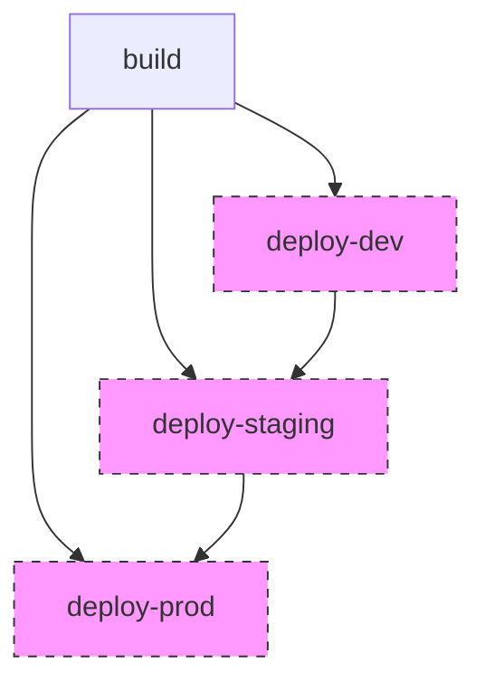

# GitHub Actions Workflow: Deploy to Azure Container Apps

<div align="center">
  
</div>

## Overview

Deploy an application to Azure Container Apps with GitHub Actions

**File Path**: `./examples/workflows/deploy-aca.yml`

<div class="workflow-diagram">
  
</div>



## Triggers

| Event Type | Conditions | Description |
|------------|------------|-------------|

## Environment Variables

| Name | Source | Default | Description |
|------|--------|---------|-------------|
| `REGISTRY` | Workflow | `ghcr.io` | - |
| `APP_NAME` | Workflow | `${{ github.repository_owner }}-app` | - |
| `APP_NAME` | Set by user | - | Required environment variable |
| `REGISTRY` | Set by user | - | Required environment variable |

## Jobs

### build

<div class="job-card">
  <div class="job-header">
    <h4>build</h4>
    <span class="badge">Required</span>
  </div>
  <p>build job</p>
  <table>
    <tr><td><strong>Runs On</strong></td><td>ubuntu-latest</td></tr>
  </table>
  <div class="steps">
    <ol>
      <li>Checkout code</li>
      <li>Set up Docker Buildx</li>
      <li>Login to GitHub Container Registry</li>
      <li>Extract Docker metadata</li>
      <li>Build and push Docker image</li>
    </ol>
  </div>
</div>

### deploy-dev

<div class="job-card">
  <div class="job-header">
    <h4>deploy-dev</h4>
    <span class="badge">Conditional</span>
  </div>
  <p>deploy-dev job</p>
  <table>
    <tr><td><strong>Runs On</strong></td><td>ubuntu-latest</td></tr>
    <tr><td><strong>Depends On</strong></td><td>build</td></tr>
    <tr><td><strong>Condition</strong></td><td><code>github.event_name != 'pull_request' || github.event.inputs.environment == 'dev'</code></td></tr>
  </table>
  <div class="steps">
    <ol>
      <li>Azure Login</li>
      <li>Deploy to Container App</li>
    </ol>
  </div>
</div>

### deploy-staging

<div class="job-card">
  <div class="job-header">
    <h4>deploy-staging</h4>
    <span class="badge">Conditional</span>
  </div>
  <p>deploy-staging job</p>
  <table>
    <tr><td><strong>Runs On</strong></td><td>ubuntu-latest</td></tr>
    <tr><td><strong>Depends On</strong></td><td>build, deploy-dev</td></tr>
    <tr><td><strong>Condition</strong></td><td><code>github.ref == 'refs/heads/main' && (github.event_name != 'pull_request' || github.event.inputs.environment == 'staging')</code></td></tr>
  </table>
  <div class="steps">
    <ol>
      <li>Azure Login</li>
      <li>Deploy to Container App</li>
    </ol>
  </div>
</div>

### deploy-prod

<div class="job-card">
  <div class="job-header">
    <h4>deploy-prod</h4>
    <span class="badge">Conditional</span>
  </div>
  <p>deploy-prod job</p>
  <table>
    <tr><td><strong>Runs On</strong></td><td>ubuntu-latest</td></tr>
    <tr><td><strong>Depends On</strong></td><td>build, deploy-staging</td></tr>
    <tr><td><strong>Condition</strong></td><td><code>github.ref == 'refs/heads/main' && github.event.inputs.environment == 'prod'</code></td></tr>
  </table>
  <div class="steps">
    <ol>
      <li>Azure Login</li>
      <li>Deploy to Container App</li>
    </ol>
  </div>
</div>

## Concurrency Control

The workflow uses a concurrency group based on `` to prevent duplicate runs:

```yaml
concurrency:
  group: 
  cancel-in-progress: false
```

This ensures that:
- Multiple workflow runs of the same type don't execute simultaneously
- Running workflows are not canceled when a new event occurs
## Job Dependencies and Flow

```
build
  └─► deploy-dev
    └─► deploy-staging
      └─► deploy-prod
```

## AI-Generated Implementation Notes

> This workflow implements a sophisticated two-step parallelism strategy that optimizes deployment performance while preventing resource conflicts. The matrix-based job generation allows flexible scaling from small to large deployments, while the concurrency group mechanism ensures that resources with potential conflicts deploy sequentially. The isolation between prepare, build/plan, apply and destroy phases follows infrastructure-as-code best practices by separating read and write operations.

## Related Documentation

- [GitHub Actions Documentation](https://docs.github.com/en/actions)
- [Workflow Syntax Reference](https://docs.github.com/en/actions/using-workflows/workflow-syntax-for-github-actions)

---

<div class="footer">
  <p>Generated by GitHub Actions Documentation Generator v1.0.0</p>
  <p>Last updated: 2025-06-14 • <a href="#">Report an issue</a></p>
</div>