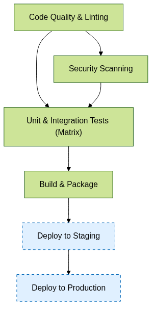

# GitHub Actions Workflow: Comprehensive Test & Deploy Pipeline

> **Note:** This documentation is auto-generated. For details, see the workflow YAML.

---

## Table of Contents

- [Overview](#overview)
- [Workflow Diagram](#workflow-diagram)
- [Triggers](#triggers)
- [Inputs](#inputs)
- [Environment Variables](#environment-variables)
- [Jobs](#jobs)
- [Execution Flow](#execution-flow)
- [Related Documentation](#related-documentation)

---

## Overview

This workflow handles the complete CI/CD pipeline from testing to deployment, with integrated security checks and notifications.

**File Path:** `./.github/workflows/test-workflow.yml`

---

## Workflow Diagram

<div class="workflow-diagram">
  
</div>

---

## Triggers

| Event Type | Conditions | Description |
|------------|------------|-------------|
| `push` | branches: `main`, `develop`, paths-ignore: `**.md`, `docs/**` | Run workflow when code is pushed to main or develop branches, ignoring documentation files |
| `pull_request` | branches: `main`, `develop`, types: `opened`, `synchronize`, `reopened` | Run workflow when PRs are opened or updated against main or develop branches |
| `schedule` |  | Run weekly security scans automatically every Sunday at 2:00 AM UTC |
| `workflow_dispatch` | inputs: {"environment": {"description": "Environment to deploy to", "required": true, "default": "staging", "type": "choice", "options": ["staging", "production"]}, "debug-logs": {"description": "Enable debug logging", "required": false, "default": false, "type": "boolean"}} | Allow manual triggering of the workflow with custom parameters<br>Inputs: `environment` (required, default: `staging`), `debug-logs` (optional, default: `False`) |
---

## Inputs

| Name | Type | Required | Default | Description |
|------|------|----------|---------|-------------|
| `environment` | `choice` | true | `staging` | Environment to deploy to |
| `debug-logs` | `boolean` | false | N/A | Enable debug logging |
---

## Environment Variables

| Name | Source | Default | Description |
|------|--------|---------|-------------|
| `PYTHON_VERSION` | Workflow | `3.10` | - |
| `NODE_VERSION` | Workflow | `18` | - |
| `CACHE_KEY_PREFIX` | Workflow | `v1-dependencies` | - |
| `PYTHON_VERSION` | Set by user | - | Required environment variable |
---

## Jobs

### Job Summary

| Job Name | Runs On | Depends On | Condition |
|----------|---------|------------|-----------|
| Code Quality & Linting | `ubuntu-latest` | - | - |
| Security Scanning | `ubuntu-latest` | code-quality | - |
| Unit & Integration Tests | `ubuntu-latest` | code-quality, security-scan | - |
| Build & Package | `ubuntu-latest` | test | - |
| Deploy to Staging | `ubuntu-latest` | build | `github.event_name == 'push' && (github.ref == 'refs/heads/main' || github.ref == 'refs/heads/develop')` |
| Deploy to Production | `ubuntu-latest` | deploy-staging | `github.event_name == 'workflow_dispatch' && github.event.inputs.environment == 'production'` |
---

### Code Quality & Linting

<div class="job-card">
  <div class="job-header">
    <h4>Code Quality & Linting</h4>
    <span class="badge">Required</span>
  </div>
  <p>Code Quality & Linting job</p>
  <table>
    <tr><td><strong>Runs On</strong></td><td>ubuntu-latest</td></tr>
  </table>
  <div class="steps">
    <p><strong>Steps</strong>:</p>
    <ol>
      <li>Checkout Repository</li>
      <li>Set up Python</li>
      <li>Install Linting Tools</li>
      <li>Run Linters</li>
      <li>Set Quality Status</li>
    </ol>
  </div>
</div>

### Security Scanning

<div class="job-card">
  <div class="job-header">
    <h4>Security Scanning</h4>
    <span class="badge">Dependent</span>
  </div>
  <p>Security Scanning job</p>
  <table>
    <tr><td><strong>Runs On</strong></td><td>ubuntu-latest</td></tr>
    <tr><td><strong>Depends On</strong></td><td>code-quality</td></tr>
  </table>
  <div class="steps">
    <p><strong>Steps</strong>:</p>
    <ol>
      <li>Checkout Repository</li>
      <li>Set up Python</li>
      <li>Install Security Tools</li>
      <li>Check Dependencies</li>
      <li>Run Security Scan</li>
    </ol>
  </div>
</div>

### Unit & Integration Tests

<div class="job-card">
  <div class="job-header">
    <h4>Unit & Integration Tests</h4>
    <span class="badge">Dependent</span>
  </div>
  <p>Unit & Integration Tests job</p>
  <table>
    <tr><td><strong>Runs On</strong></td><td>ubuntu-latest</td></tr>
    <tr><td><strong>Depends On</strong></td><td>code-quality, security-scan</td></tr>
    <tr><td><strong>Strategy</strong></td><td>Matrix with {"python-version": ["3.9", "3.10", "3.11"], "os": ["ubuntu-latest", "windows-latest"]}, fail-fast: False</td></tr>
    <tr><td><strong>Max Parallel</strong></td><td>None</td></tr>
  </table>
  <div class="steps">
    <p><strong>Steps</strong>:</p>
    <ol>
      <li>Checkout Repository</li>
      <li>Set up Python ${{ matrix.python-version }}</li>
      <li>Install Dependencies</li>
      <li>Test with pytest</li>
      <li>Upload Coverage Report</li>
    </ol>
  </div>
</div>

### Build & Package

<div class="job-card">
  <div class="job-header">
    <h4>Build & Package</h4>
    <span class="badge">Dependent</span>
  </div>
  <p>Build & Package job</p>
  <table>
    <tr><td><strong>Runs On</strong></td><td>ubuntu-latest</td></tr>
    <tr><td><strong>Depends On</strong></td><td>test</td></tr>
  </table>
  <div class="steps">
    <p><strong>Steps</strong>:</p>
    <ol>
      <li>Checkout Repository</li>
      <li>Set up Python</li>
      <li>Install Build Tools</li>
      <li>Build Package</li>
      <li>Upload Build Artifacts</li>
    </ol>
  </div>
</div>

### Deploy to Staging

<div class="job-card">
  <div class="job-header">
    <h4>Deploy to Staging</h4>
    <span class="badge">Conditional</span>
  </div>
  <p>Deploy to Staging job</p>
  <table>
    <tr><td><strong>Runs On</strong></td><td>ubuntu-latest</td></tr>
    <tr><td><strong>Depends On</strong></td><td>build</td></tr>
    <tr><td><strong>Condition</strong></td><td><code>github.event_name == 'push' && (github.ref == 'refs/heads/main' || github.ref == 'refs/heads/develop')</code></td></tr>
  </table>
  <div class="steps">
    <p><strong>Steps</strong>:</p>
    <ol>
      <li>Download Build Artifacts</li>
      <li>Deploy to Staging</li>
      <li>Send Notification</li>
    </ol>
  </div>
</div>

### Deploy to Production

<div class="job-card">
  <div class="job-header">
    <h4>Deploy to Production</h4>
    <span class="badge">Conditional</span>
  </div>
  <p>Deploy to Production job</p>
  <table>
    <tr><td><strong>Runs On</strong></td><td>ubuntu-latest</td></tr>
    <tr><td><strong>Depends On</strong></td><td>deploy-staging</td></tr>
    <tr><td><strong>Condition</strong></td><td><code>github.event_name == 'workflow_dispatch' && github.event.inputs.environment == 'production'</code></td></tr>
  </table>
  <div class="steps">
    <p><strong>Steps</strong>:</p>
    <ol>
      <li>Download Build Artifacts</li>
      <li>Deploy to Production</li>
      <li>Send Notification</li>
    </ol>
  </div>
</div>

---

## Execution Flow

```
code-quality
  └─► security-scan
    └─► test
      └─► build
        └─► deploy-staging
          └─► deploy-production
```

---

## AI-Generated Usage Information

> This comprehensive GitHub Actions workflow is designed to manage an entire CI/CD pipeline for code housed in a GitHub repository. It's particularly suited for Python-based projects needing code quality checks, security scans, testing across multiple environments, build & packaging of artifacts, and deployment to staging and production environments. This workflow should be used when you require thorough checks and deployment automation with a preference for cleanliness, security, and reliability of the codebase.
> 
> You can trigger this workflow in several ways:
> 
> a. Automatically, when code is pushed to the `main` or `develop` branches (excluding markdown and documentation files located in the `docs` directory).
> b. Upon opening, synchronizing, or reopening a pull request against the `main` or `develop` branches.
> c. A scheduled trigger for weekly security scanning each Sunday at 2:00 AM UTC.
> d. Manually using the `workflow_dispatch` event, which allows for specifying the target environment ("staging" or "production") and whether to enable verbose debug logging.
> 
> For manual triggering via `workflow_dispatch`, you can supply inputs using the GitHub UI or through the API. For instance, to trigger deployment to production with debug logs enabled, you would set `environment` to `"production"` and `debug-logs` to `true`.
> 
> When the workflow runs successfully, you can expect:
> 
> - Code quality checks, including linting and static analysis, to pass without errors.
> - Successful scans for security vulnerabilities in both the codebase and dependencies.
> - Completion of unit and integration tests across multiple Python versions and operating systems with no failures.
> - Creation of a built Python package artifact, which is then used for deployment.
> - If changes are on `main` or `develop`, an automatic deployment to a staging environment occurs, along with notifications sent to a configured Slack channel.
> - For production deployment, manual approval is required, after which the same deployment and notification steps as for staging occur, tailored for the production environment.
> 
> The workflow produces a Python package artifact and reports any issues found during linting, security scanning, and testing. Notifications about deployment status are sent to Slack, but you must replace placeholder values with real secrets to enable these notifications in a production setup.
> 
> Common use cases for this workflow include projects that require stringent quality and security assurances before deployment, those that practice branch-based deployment strategies (e.g., to separate staging and production environments), or any repository where maintainers wish to have both automated and manual control over the deployment process. It's especially handy where Python dependencies need to be cached for faster build times and where multi-environment testing is critical.

## AI-Suggested Improvements

> 1. Implement Dependency Caching:
>    - This workflow makes use of Python and installs dependencies in multiple jobs (`code-quality`, `security-scan`, `test`, `build`). Utilizing cache can significantly reduce build times and save GitHub Actions minutes.
>    - Caching dependencies will allow you to reuse the same packages across workflow runs if the dependency files (`requirements.txt`, etc.) have not changed, avoiding unnecessary downloads from PyPI.
> 
>    Implementation example:
>    ```yaml
>    - name: Cache Python dependencies
>      uses: actions/cache@v3
>      with:
>        path: ~/.cache/pip
>        key: ${{ env.CACHE_KEY_PREFIX }}-${{ runner.os }}-py-${{ hashFiles('**/requirements*.txt') }}
>        restore-keys: |
>          ${{ env.CACHE_KEY_PREFIX }}-${{ runner.os }}-py-
>    ```
> 
> 2. Introduce Job Timeouts:
>    - The workflow does not implement timeouts, which can result in unnecessarily prolonged or "stuck" actions that can consume CI/CD minutes and potentially block the pipeline.
>    - Setting job timeouts enforces limits on how long a job can run before being automatically cancelled. This helps to reduce the risk of exhausting resources and stuck jobs.
> 
>    Implementation example:
>    ```yaml
>    jobs:
>      code-quality:
>        timeout-minutes: 10
>        # ... rest of job ...
>    ```
> 
> 3. Utilize Secrets for Sensitive Data:
>    - The `notify` step suggests you would reference secrets for the Slack webhook; however, the example does not include usage of GitHub secrets.
>    - Using GitHub secrets for sensitive information such as API keys, access tokens, and webhook URLs is vital for security. Storing sensitive information in the repository, even if it's private, is a bad practice and can result in compromised systems if the data is exposed.
> 
>    Implementation example:
>    ```yaml
>    # In the 'env:' section of the 'notify' step
>    env:
>      SLACK_WEBHOOK_URL: ${{ secrets.SLACK_WEBHOOK_URL }}
>    ```
> 
> 4. Include Artifact Verification Before Deployment:
>    - The deployment steps (`deploy-staging`, `deploy-production`) do not include any artifact verification to check the integrity of the package before it is deployed.
>    - Including a checksum verification or digital signature check can ensure that the artifacts have not been tampered with or corrupted between the build and deployment steps.
> 
>    Implementation example:
>    ```yaml
>    - name: Verify Build Artifacts
>      run: |
>        echo "Verifying build artifacts checksum..."
>        # Replace 'file_to_verify' and 'checksum_file' with actual filenames
>        sha256sum -c checksum_file
>    ```
> 
> 5. Error Handling and Notifications for Failed Steps:
>    - The workflow does not appear to handle failure cases or send notifications for failed builds.
>    - Implementing error handling and sending notifications on failure alert the relevant team members quickly so they can take action, which is crucial for maintaining a robust CI/CD pipeline.
> 
>    Implementation example:
>    ```yaml
>    jobs:
>      # ... other job definitions ...
>      notify-on-failure:
>        runs-on: ubuntu-latest
>        if: ${{ failure() }}
>        steps:
>          - name: Notify on Failure
>            uses: some/notification-action@version
>            with:
>              message: "Workflow failed at ${{ github.event_name }}"
>              # ... other configuration ...
>            env:
>              # ... environment variables and secrets ...
>    ```

## Related Documentation

- [GitHub Actions Documentation](https://docs.github.com/en/actions)
- [Workflow Syntax Reference](https://docs.github.com/en/actions/using-workflows/workflow-syntax-for-github-actions)

---
